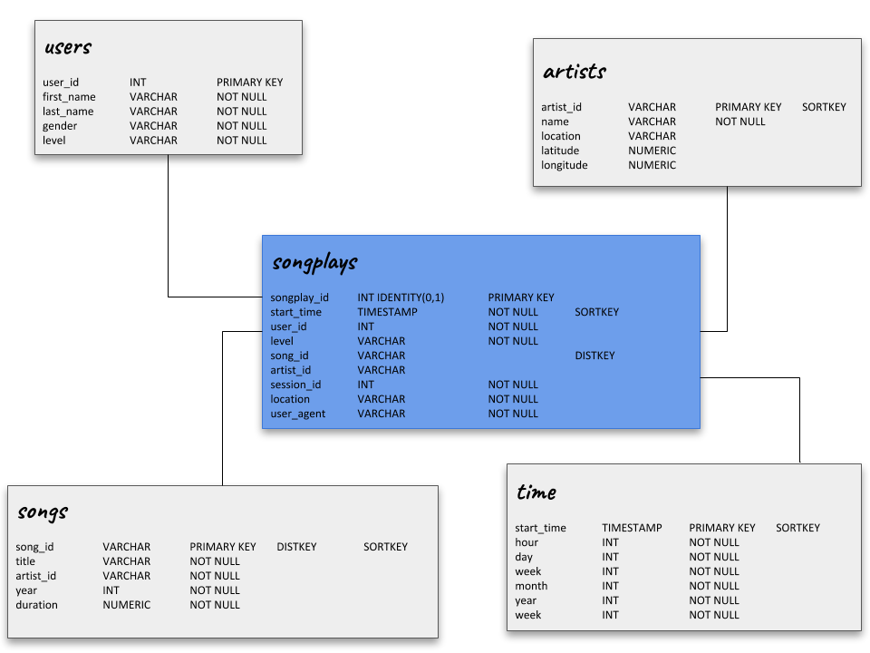

# Sparkify
### Data Warehouse

This project aims to modeling the database and keep the information about the usage of Sparkify. 

The importance of this is create a data warehouse where we can provide the information about Sparkify using a Amazon RedShift on AWS to disponibilize the data in a better format to analysis.

## Database structure
The image below represents the schema choosen to our database:


In this project we are woorking with a star schema which consists in a fact table referencing multiples dimensions tables. It is a simple schema focused in make fast aggregations and guarantee easiers queries.

The name of our fact table is songplays and there we are going to keep the data about the song played on Sparkify. It is the main information about the startup and where we can make some analyzis to better understand the user and your preferences.

Besides that, the schema contains four more dimensions tables (users, songs, artists and time) where is the data that categorize the information we find in songplays table.
The information contained in each table is described here:

+ ***users***: users in the app
+ ***songs***: songs in music database
+ ***artists***: artists in music database
+ ***time***: timestamps of records in songplays broken down into specific units

Before insert the data into these tables, we copy the log files content to staging tables to make easier the process of Join when we need to insert a value in songplays table.

## How to execute the project
While we are in development, the first step to test this project is clean all existing databases and create them again. This way we will always be working with a clean database. So, the first step is run the code below:

``` 
$ python create_tables.py
```

After this, we execute the script that processes all files and, from them, inserts the values in each table.

```
$ python etl.py
```

### create_tables.py functions
+ **drop_tables**
It uses the list of drop tables queries in sql_queries.py and processes each one to clean the existing database.

+ **create_tables**
It drops the database and creates it again, then uses the list of created tables queries in sql_queries.py and processes each one to create the tables.

+ **main**
It gets the configuration values defined in **dwh.cfg** file. With this values it's possible connect with RedShift using the **psycopg2.connect**. When the connection is established this method calls the two methods above to recreate the tables.

### etl.py functions
+ **load_staging_tables**
It uses the list of copy commands defined in sql_queries to get the data from S3 Bucket and fill the staging tables.

+ **insert_tables**
It uses this list of insert commands defined in sql_queries to select the data from staging tables and fill the tables from star schema.

+ **main**
It opens the conection with the Redshift using the configuration values located in **dwh.cfg** file. With an established connection its possibles call the methods above.

## Studying the data 
There is a file where we would see some analysis about the information imported to our database. To see it, after run this two scripts above, it is necessary only open the file *analysis.ipynb* and run again the rows.